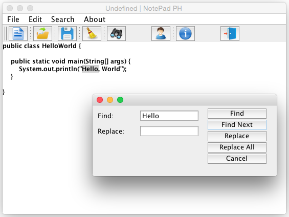

# Simple Java Text Editor

**PH NotePad** is a simple and light **text editor** (notepad) written in Java.

* Search tool (to search text/keywords easily in the code) + highlighting the code found.

* Find/Replace text/code.

* Auto completion for Java and C++ keywords (files need to be saved as *.java*/*.cpp*). It can be easily expanded to support pretty much any number of languages.

* Drag and Drop (drag files into the text area and they get loaded).

* Nice image buttons for better UX.

